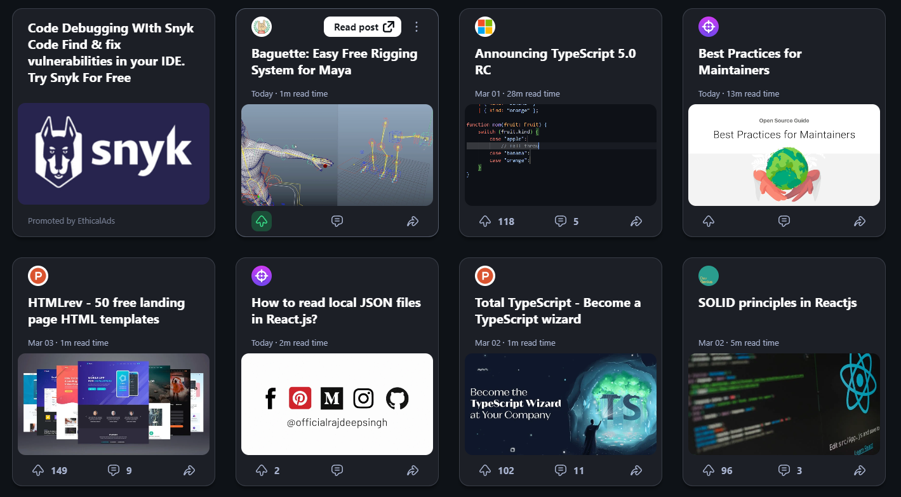

# Node 4 : Projet Blog, veille technologique


Vous êtes en charge de développer un blog sur l'actualité du métier, pour en faire votre veille technologique.

Cette plateforme ne sera pas accessible au grand public, mais uniquement à tous les étudiants CDA.

## Stack technique

- Back-end : Node.js / Express / Mongo 
- Front-end : HTML, CSS, React 

## Présentation du fonctionnement 



### Utilisateur :
Pour accéder au contenu global du blog, l'utilisateur doit être connecté/authentifié. 
Il est fortement conseillé d'utiliser un outil cryptographique pour les mots de passe (bcrypt ou crypto etc.)


Dès lors que l'utilisateur s'est connecté il doit être redirigé vers la page d'accueil, qui affichera sous forme de card les 6 articles plus récents avec leur titre.

Dans cette page, il est possible de faire une recherche sur le titre d'un article ou sur un tag (cf. modèle d'un article), pour sortir dynamiquement tous les articles contenant le résultat de la recherche (pas de reload)


Lorsque l'on clique sur un article, cela doit nous nous rediriger sur une page avec toutes les informations d'un article.

L'utilisateur doit être en mesure en bas de chaque article de poster un commentaire.

Il a également la possibilité de mettre un "like" à l'article et la possibilité de mettre l'article dans ses favoris. (Vous pouvez pour les favoris, utiliser le localStorage ou le centraliser via le store Redux).

La page Favoris affiche les cards des articles comme sur la page d'accueil.

L'utilisateur doit être en mesure d'éditer son profil et de se déconnecter.

Un utilisateur détient donc les privilèges suivants: 

- Créer, modifier ou éditer (SES PROPRES ARTICLES)
- Accéder à son profil (édition)
- Accéder à ses favoris


### Administrateur :
Un administrateur détient les privilèges suivants: 

- Supprimer, éditer (TOUS LES ARTICLES) ou créer un article
- Supprimer, éditer (TOUS LES UTILISATEURS) ou créer un utilisateur
- Il peut donner le rôle Adminstrateur à d'autres utilisateurs

Dans son Dashboard, il  peut s'il est administrateur avoir un bouton "Ajouter un utilisateur"


## Contraintes serveur


Vous **devez** utiliser les éléments suivants :

- Express.js
- MongoDB + Mongoose 

Les échanges entre le client et le serveur doivent se faire en mode API uniquement (pas de système de template avec Twing/Pug, que des échanges JSON)

Le système d'authentification doit se faire soit via  **JSON Web Token** (avec `jsonwebtoken`).

Les appels API doivent être authentifiés :

- Dans le cas de JSON Web Token, chaque requête authentifiée devra inclure le token dans le header HTTP `Authorization: Bearer <token>`

## Contraintes Client

Vous **devez** utiliser la bibliothèque React, avec le bundler [ViteJS](https://vitejs.dev/) (qui est beaucoup plus rapide que `create-react-app`).

Le choix d'un framework CSS (Bootstrap / Tailwind) est totalement libre.

Vous devez faire une fonction de recherche

Le choix d'une bibliothèque d'échanges HTTP comme `axios` ou `superagent` n'est pas obligatoire, mais fortement conseillée.

Vous organiserez vos dossiers selon l'architecture suivante :

```bash
.
└── src/
    ├── views       # les composants de page
    ├── components  # les composants d'affichage (card, forms, …)
    ├── services    # les services (http)
    └── features    # les features React Web Toolkit (si vous faites du React-Redux : non obligatoire)
```

---
## Détails

Une base d'utilisateurs est déjà fournie avec l'énoncé (fichier `users.json`) afin que vous puissiez commencer à travailler avec des données. N'hésitez pas à consulter et analyser ces informations avant de démarrer.

La structure d'un utilisateur est la suivante :

```
id          -   Identifiant unique du collaborateur 
gender      -   Sexe ("male" ou "female")
firstname   -   Prénom
lastname    -   Nom
email       -   Email pro
password    -   Mot de passe haché avec bcrypt
photo       -   Une image
category    -   Si l'utilisateur est orienté NodeJS ou Symfony (vous pouvez mettre JS/PHP)
isAdmin     -   Si l'utilisateur est un administrateur de la platforme (Booléen)
```

La structure d'un article est la suivante :

```
id          -   Identifiant unique de l'article 
author      -   l'auteur de l'article, cela fait une référence à la collection utilisateur (on va se servir de l'objectID de l'user)
content     -   Le contenu de l'article
image       -   Une image de l'article
date        -   le timestamp de l'article 
tag         -   un tag définissant l'article (par ex. front, back, php,js,node,react,angular) une catégorie
likeCount   -   Le compteur à chaque fois qu'un utilisateur "like" l'article en question
```


Les images cette fois ci doivent être gérées sur le serveur en utilisant multer ou formidable, mais attention à bien définir une taille limite lors de l'upload des images. 

## BONUS: 

Dans votre card vous pouvez définir le temps de lecture d'un article. Pour information sachez qu'un adulte lit entre 250 et 300 mots par minutes, il serait judiciable d'avoir une fonction qui retourne le nombre de mots par article et de faire un calcul approprié afin de savoir combien de temps cela met.

